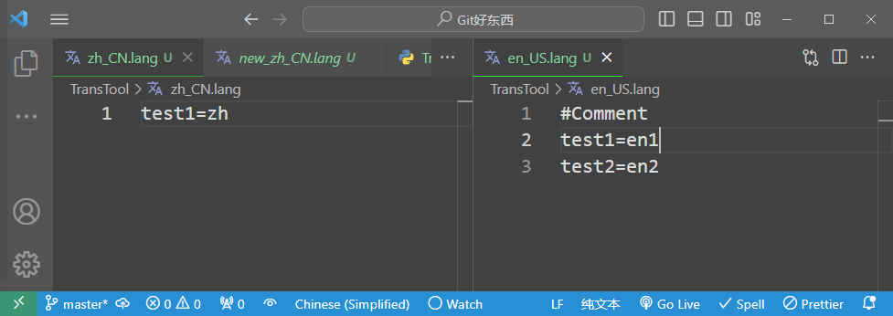
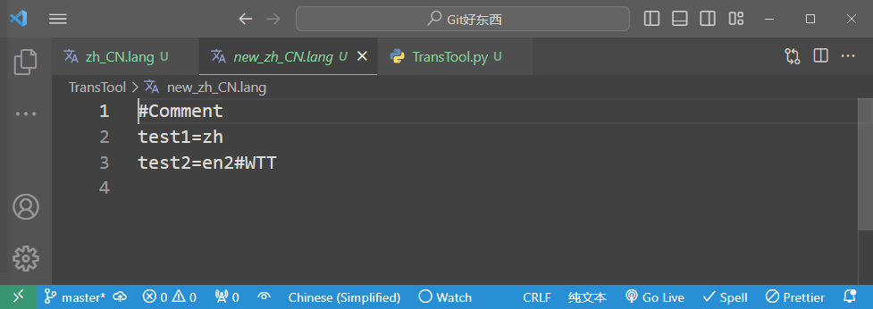
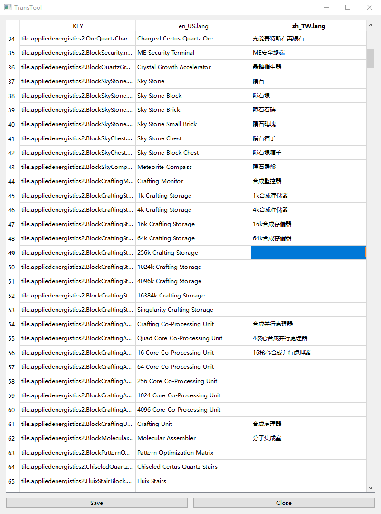
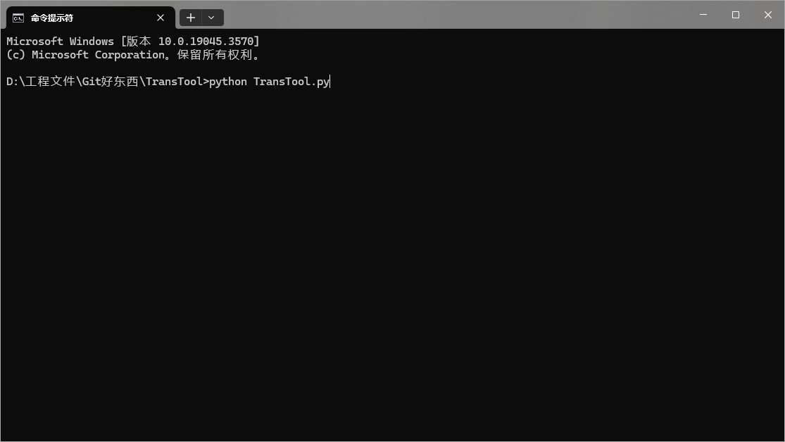
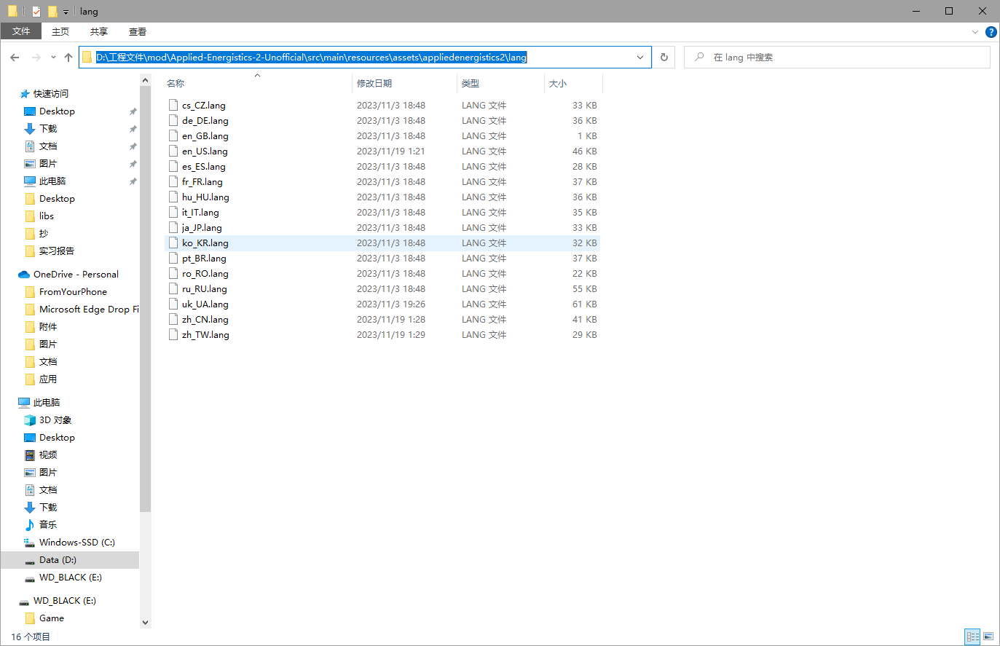
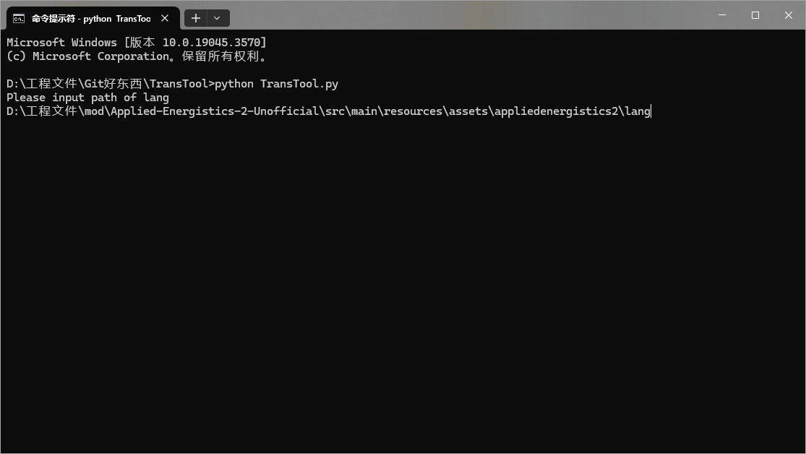
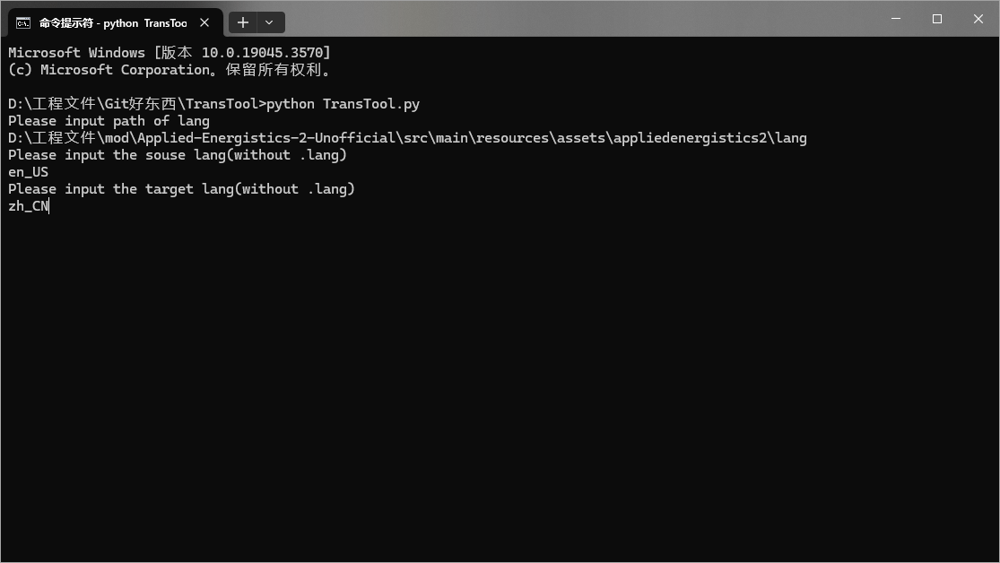
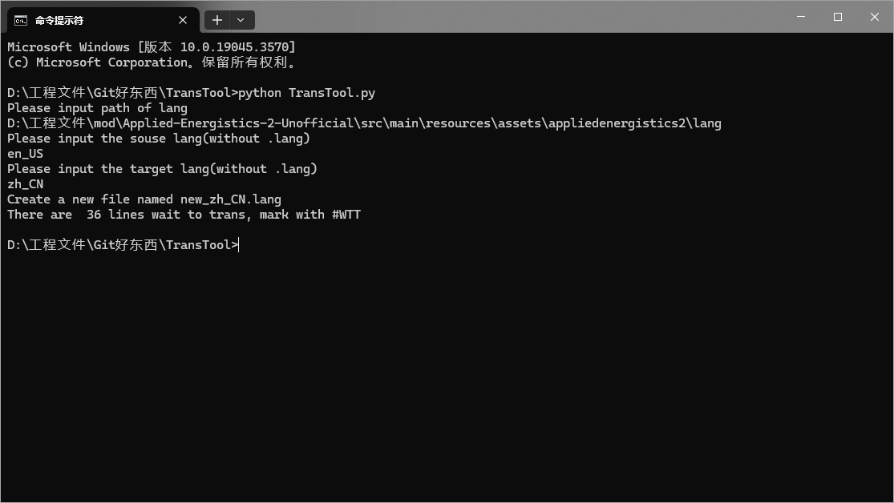
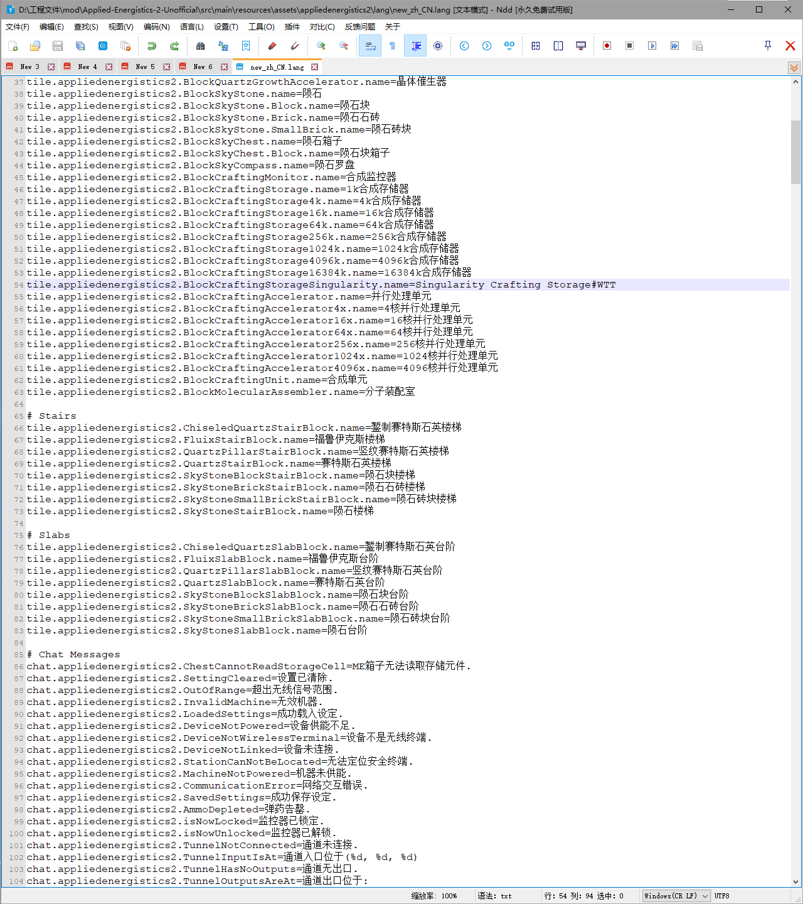
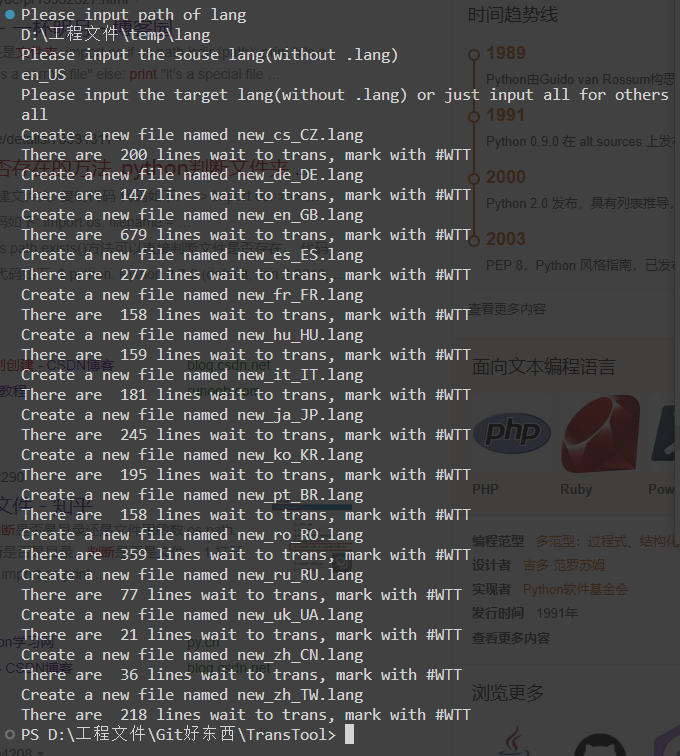

# README.md

- [English](README.md)
- [简体中文](README.zh_CN.md)

## Fuction

Compare 2 lang file, and use first one as a template.

If there are translate in second lang it will use it.

If there are not translate in second lang, it will use the original text in the first one, and mark it #WTT(Wait To Translate)

Finaly will out put all entry into a new file, then you can easily translate those untranslated text.

### terminal ver

### gui ver

## How To Use

1. Make sure that python is install in your computer
2. Open your termianl and run `python TransTool.py`

3. Input your lang file folder path

4. Input the source and your target lang file

5. Check the new lang file in your folder, and just translate it.

## UPDATE

1. You can input `all` for source the can create all other lang in folder

